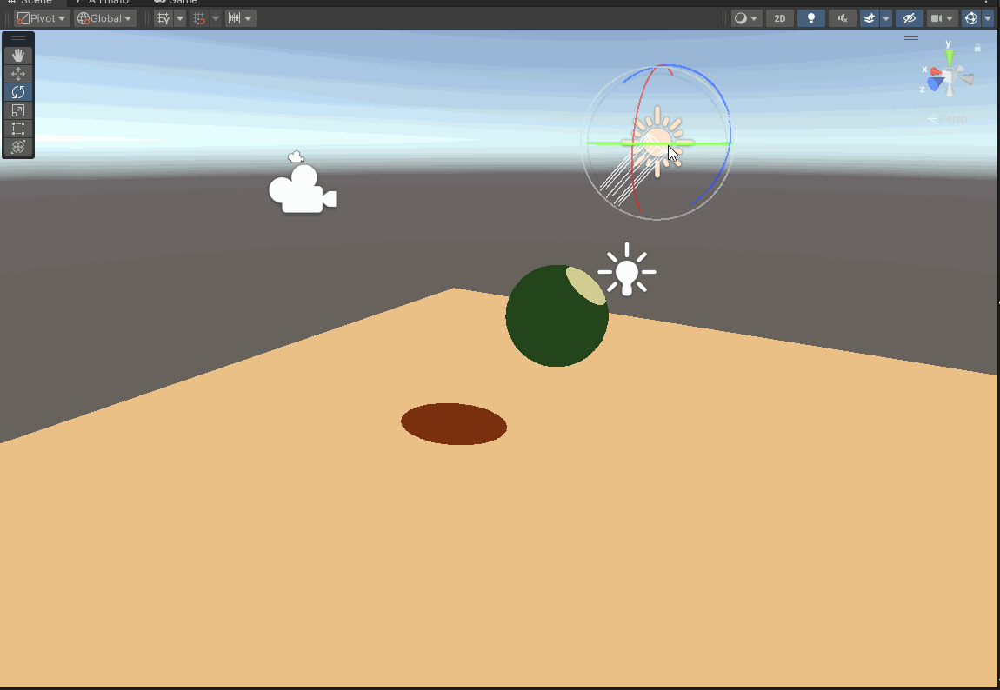
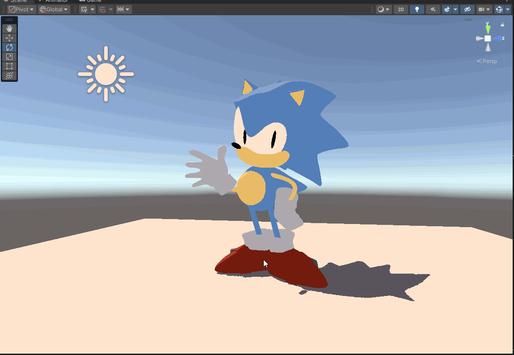
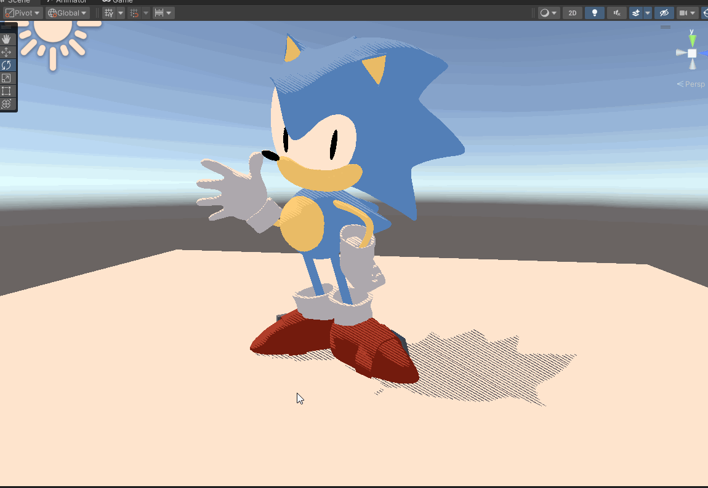
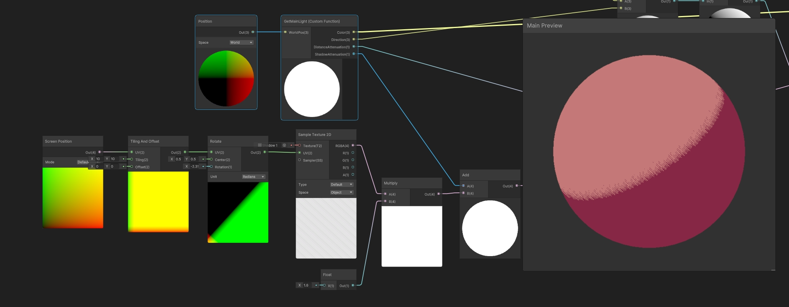

# Lab 05 - Stylization!
## Puzzle 1
Basic toon shader implementation

## Puzzle 2
Stylized Sonic model

## Puzzle 3
Stylized shadow
- I used the provided stripe texture as the sample 2D texture and adjusted the texture uv to expand the number of stripes. Finally, I added shadow attenuation with the stripe texture to create a striped shadow shading effect.

